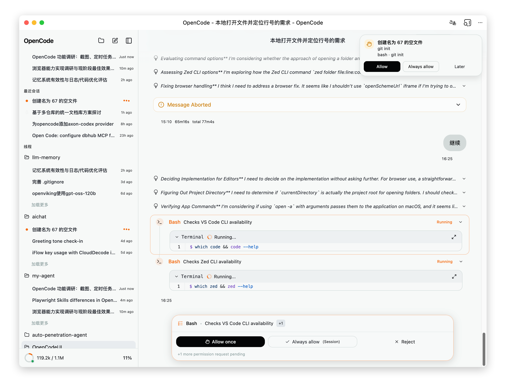
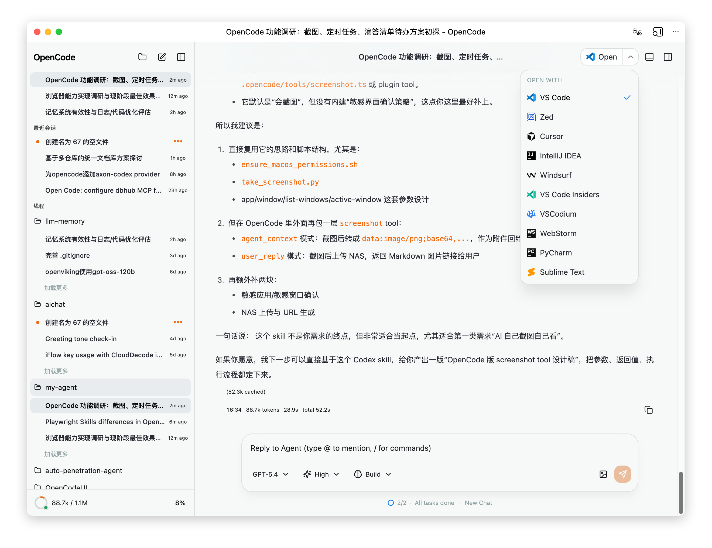
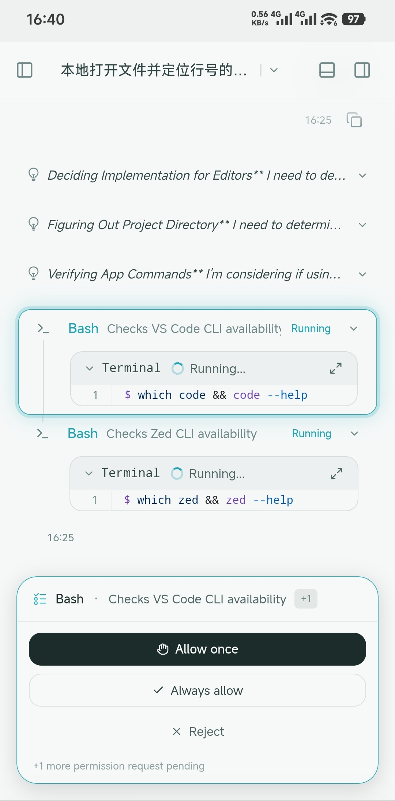
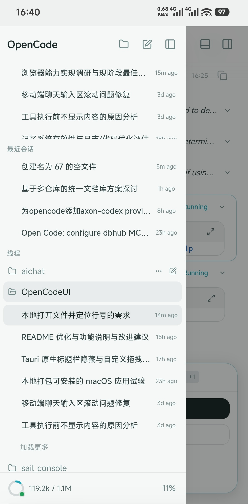

# OpenCodeUI

[中文](./README.md) | English

[](https://github.com/barryoo/OpenCodeUI/actions/workflows/ci.yml)
[](https://github.com/barryoo/OpenCodeUI/releases)
[](./LICENSE)

A third-party Web / Desktop UI for [OpenCode](https://github.com/anomalyco/opencode), focused on multi-project workflows, mobile usability, native desktop features, and container-based deployment.

> This repository is a secondary development branch based on [lehhair/OpenCodeUI](https://github.com/lehhair/OpenCodeUI). On top of the original project's OpenCode workflow and deployment capabilities, the current fork focuses on improving desktop experience, session management, message rendering, and mobile UX.

> Disclaimer: this project is provided for learning and experimentation. It is still evolving and may contain bugs or behavioral changes.

## Highlights

- Built for multi-project, multi-session, multi-window workflows
- Available as a browser app, Tauri desktop app, and Docker deployment
- Preserves the OpenCode tool-driven workflow while improving tool feedback, diff readability, attachments, and file interactions
- Includes many mobile-oriented refinements around safe areas, input behavior, notifications, and toolbar ergonomics

## Core Features

| Area | Capabilities |
|------|--------------|
| Chat experience | Streaming replies, Markdown rendering, Shiki syntax highlighting, reasoning/tool state visualization |
| Workspace collaboration | File browser, file preview, multi-file diff, @ mentions, slash commands |
| Session management | Multi-project switching, recent sessions, pinning, notification state, fast new-session entry |
| Terminal and tools | Built-in xterm.js terminal, tool-call visualization, context and attachment detail views |
| Personalization | Theme presets, custom CSS, keyboard shortcuts, fine-grained settings |
| Runtime targets | Web, PWA, Tauri desktop app, standalone frontend Docker, full Docker gateway stack |

## Enhancements Over the Upstream Project

The list below is based on this repository's commit history and current implementation, with the goal of describing the user-facing improvements more explicitly.

### Notifications and Permission Flow

| Improvement | Description |
|-------------|-------------|
| In-app foreground notifications | Permission requests, questions, completions, and errors are surfaced through top-right toast notifications inside the app |
| Background system notifications | Browser and Tauri system notifications can alert the user even when the app is not in the foreground |
| Direct permission actions in toast | Permission toasts can be handled immediately with `Allow`, `Always allow`, or `Later` without switching back first |
| Unread markers in the session list | Sessions with new notifications show a visible unread dot in the sidebar |
| Notification-session linkage | Opening the related session or clicking the toast marks the notification as read automatically |
| Active session state tracking | Session status is derived from SSE, permission requests, and question requests so busy sessions remain visible and understandable |

### Project and Session Management

| Improvement | Description |
|-------------|-------------|
| Multi-project sidebar mode | Projects and sessions are organized in a single sidebar for multi-workspace usage |
| Running status in the session list | Session items show animated running indicators so users can quickly see which session is still active |
| Visible waiting states | Sessions waiting for permission approval or question input are shown as waiting for user action rather than appearing stuck |
| Project-scoped session creation | New sessions can be created directly inside a specific project |
| Recent and pinned sessions | Frequently used sessions can be pinned, and recently active sessions are grouped for quicker access |
| Drag-and-drop project ordering | Projects can be reordered by drag and drop to match personal workflow priority |
| Drag external folders to create projects | In the Tauri desktop app, external folders can be dropped into the app to create projects quickly |
| Clearer empty-state project context | The empty chat state shows the current project name to reduce mistakes in multi-project workflows |

### Chat Messages and Tool Feedback

| Improvement | Description |
|-------------|-------------|
| Collapsible long user messages | Long prompts can be expanded or collapsed so the chat area stays readable |
| Separate system-context folding | Synthetic system context attached to user messages can be expanded independently from the main prompt |
| Grouped consecutive tool calls | Consecutive tool calls are grouped into step-based blocks to reduce message fragmentation |
| Early tool intent visibility | Tool name, path, search term, or operation intent can appear before the tool fully completes |
| Pending permission tool highlighting | Tools waiting for approval are auto-expanded and highlighted so users can inspect details before allowing them |
| Turn-level file change summary | Each assistant turn can summarize touched files and line changes, with expandable per-file diff views |
| Better file path and link behavior | Message paths and links behave more naturally for opening and navigation |
| Richer attachment inspection | Attachments support detail viewing, copying, and saving, with more native save behavior on desktop |
| Errors shown directly in chat | Session errors are rendered inside the conversation instead of failing silently |
| Cleaner footer metadata | Time, token usage, message duration, and total turn duration are presented in a more unified and less noisy way |

### Mobile and Desktop Experience

| Improvement | Description |
|-------------|-------------|
| Reworked mobile input behavior | The input area has been refined across collapse, expand, scroll-to-bottom, and streaming scenarios |
| Safe-area and keyboard handling | Mobile safe areas, keyboard insets, and bottom-bar overlap issues are handled more carefully |
| Better mobile selectors | Model, agent, @ mention, and slash command menus are positioned and sized more appropriately on mobile |
| Improved mobile sidebar interactions | The sidebar is tuned for touch interactions, including gesture handling, long press actions, and cleaner action visibility |
| Better Tauri desktop polish | On top of the upstream Tauri support, this fork further improves macOS titlebar behavior, window interaction, and folder drop handling |
| Fast open-in-editor flow | The chat header can open the current project directly in a local editor, making IDE round-trips much smoother |

## Screenshots

### Desktop




### Mobile




## Quick Start

### Choose a Setup

| Scenario | Recommended path |
|----------|------------------|
| Fast preview | Run the frontend locally with `opencode serve` |
| You already run an OpenCode backend | `docker-compose.standalone.yml` |
| You want frontend, backend, and preview gateway together | `docker-compose.yml` |
| You prefer a native client | Download a release or build the Tauri app |

### Local Development

```bash
git clone https://github.com/barryoo/OpenCodeUI.git
cd OpenCodeUI
npm ci

# Start the OpenCode backend first
opencode serve

# Then run the frontend
npm run dev
```

The default dev URL is `http://localhost:5173`.

> The development proxy lives in `vite.config.ts`. If your OpenCode backend does not run at the default address used in this repository, update the `/api` proxy target to match your environment.

### Desktop App

Download installers from [Releases](https://github.com/barryoo/OpenCodeUI/releases), or build locally:

```bash
npm ci
npm run build:macos
```

Typical desktop artifacts:

- macOS `.app`: `src-tauri/target/release/bundle/macos/`
- Other platform installers: see the GitHub Release assets

## Docker Deployment

### Standalone Frontend Mode

Use this when you already have a reachable `opencode serve` backend and only need the UI:

```bash
git clone https://github.com/barryoo/OpenCodeUI.git
cd OpenCodeUI
docker compose -f docker-compose.standalone.yml up -d
```

Default URL: `http://localhost:3000`.

To connect to a remote backend:

```bash
BACKEND_URL=your-server.com:4096 PORT=8080 docker compose -f docker-compose.standalone.yml up -d
```

| Environment Variable | Default | Description |
|---------------------|---------|-------------|
| `BACKEND_URL` | `host.docker.internal:4096` | OpenCode backend address without protocol |
| `PORT` | `3000` | Public frontend port |

### Full Stack Mode

The full deployment includes three services:

| Service | Port | Description |
|---------|------|-------------|
| Gateway | `6658` | Unified entry for frontend and OpenCode API |
| Gateway | `6659` | Preview port for mapped dev services |
| Frontend | `3000` | Static frontend service |
| Backend | `4096` | OpenCode API |
| Router | `7070` | Dynamic route scanning and preview management |

Start everything with:

```bash
git clone https://github.com/barryoo/OpenCodeUI.git
cd OpenCodeUI
cp .env.example .env
docker compose up -d
```

Default URL: `http://localhost:6658`.

Key environment variables:

```env
ANTHROPIC_API_KEY=
OPENAI_API_KEY=
GATEWAY_PORT=6658
PREVIEW_PORT=6659
WORKSPACE=./workspace
OPENCODE_SERVER_USERNAME=opencode
OPENCODE_SERVER_PASSWORD=your-strong-password
ROUTER_SCAN_INTERVAL=5
ROUTER_PORT_RANGE=3000-9999
ROUTER_EXCLUDE_PORTS=4096
VITE_THIN_SERVER_URL=http://127.0.0.1:4097
OPENCODEUI_SERVER_PUBLIC_URL=http://127.0.0.1:4097
OPENCODEUI_FRONTEND_URL=http://127.0.0.1:5173
OPENCODEUI_SECURE_COOKIES=false
GITHUB_CLIENT_ID=
GITHUB_CLIENT_SECRET=
```

### Thin Server GitHub Login

The login flow depends on the bundled thin server.

For local development, configure at least:

```env
VITE_THIN_SERVER_URL=http://127.0.0.1:4097
OPENCODEUI_SERVER_PUBLIC_URL=http://127.0.0.1:4097
OPENCODEUI_FRONTEND_URL=http://127.0.0.1:5173
GITHUB_CLIENT_ID=your-client-id
GITHUB_CLIENT_SECRET=your-client-secret
```

GitHub OAuth callback URL:

```text
http://127.0.0.1:4097/api/auth/github/callback
```

For HTTPS production deployments, enable:

```env
OPENCODEUI_SECURE_COOKIES=true
```

This makes the thin server issue `Secure` cookies and preserve login sessions across service restarts via SQLite.

Persistence notes:

- `opencode-home` keeps OpenCode config, session cache, mise runtimes, and user-space caches
- `opencode-router-data` keeps gateway routing state
- Container rebuilds preserve the most important runtime and cache data

### Reverse Proxy

For public deployment, place a reverse proxy in front of ports `6658` and `6659`, and make sure SSE buffering is disabled.

Nginx example:

```nginx
server {
    listen 443 ssl;
    server_name opencode.example.com;

    ssl_certificate     /path/to/cert.pem;
    ssl_certificate_key /path/to/key.pem;

    location / {
        proxy_pass http://127.0.0.1:6658;
        proxy_http_version 1.1;
        proxy_set_header Connection '';
        proxy_buffering off;
        proxy_cache off;
        proxy_set_header Upgrade $http_upgrade;
        proxy_set_header Connection "upgrade";
        proxy_set_header Host $host;
        proxy_set_header X-Real-IP $remote_addr;
        proxy_set_header X-Forwarded-For $proxy_add_x_forwarded_for;
        proxy_set_header X-Forwarded-Proto $scheme;
        proxy_read_timeout 86400s;
    }
}
```

Caddy example:

```caddyfile
opencode.example.com {
    reverse_proxy 127.0.0.1:6658 {
        flush_interval -1
    }
}

preview.example.com {
    reverse_proxy 127.0.0.1:6659
}
```

## Automation Workflows

This repository currently includes the following GitHub Actions workflows:

| Workflow | Trigger | Purpose |
|----------|---------|---------|
| `CI` | `push` / `pull_request` on `master` | Runs `npm ci`, `npm run lint`, and `npm run build` |
| `Build & Push * Docker Image` | Relevant file changes on `master` | Publishes frontend, gateway, and backend images to GHCR |
| `Release` | `v*` tags | Builds desktop and Android packages and publishes a GitHub Release |

This lets the repository act as:

- the source repo for the web UI
- the image source for Docker deployments
- the release source for Tauri desktop and Android builds

## Project Structure

```text
src/
├── api/                 # API wrappers
├── components/          # Shared UI pieces (Terminal, Diff, Dialog, etc.)
├── features/            # Feature modules (chat / sessions / settings / mention / slash-command)
├── hooks/               # Custom hooks
├── store/               # State management
├── themes/              # Themes and custom styling
└── utils/               # Utilities

src-tauri/               # Tauri desktop app project
docker/                  # Docker / gateway / router config
.github/workflows/       # CI, Docker, and Release automation
```

## Upstream and Credits

- Original UI project: [`lehhair/OpenCodeUI`](https://github.com/lehhair/OpenCodeUI)
- Backend project: [`anomalyco/opencode`](https://github.com/anomalyco/opencode)
- This fork continues the original direction while emphasizing desktop support, mobile UX, session workflows, and deployment ergonomics

## License

[GPL-3.0](./LICENSE)

## Star History

<a href="https://www.star-history.com/#barryoo/OpenCodeUI&Date">
  <picture>
    <source media="(prefers-color-scheme: dark)" srcset="https://api.star-history.com/svg?repos=barryoo/OpenCodeUI&type=Date&theme=dark" />
    <source media="(prefers-color-scheme: light)" srcset="https://api.star-history.com/svg?repos=barryoo/OpenCodeUI&type=Date" />
    
  </picture>
</a>

---

Contributions are welcome for additional screenshots, comparison notes, deployment FAQs, and real-world usage examples.
